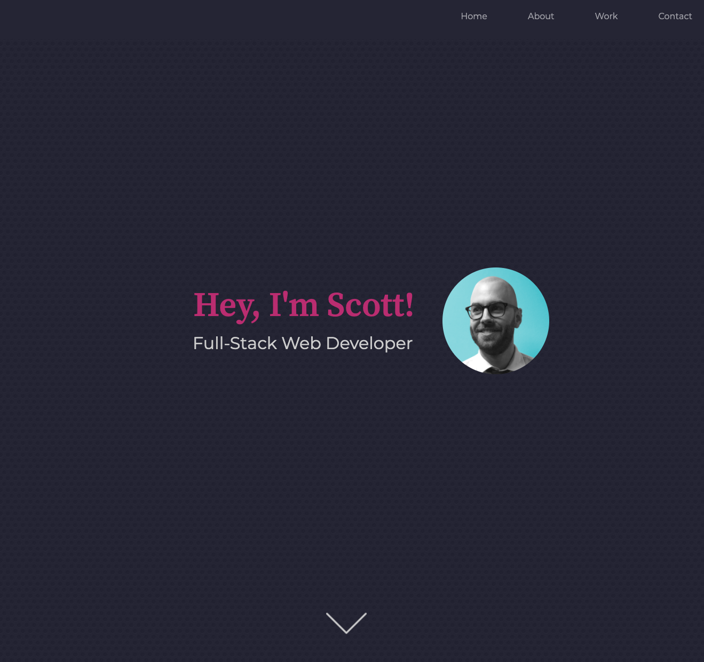

# Personal Portfolio

## Description

The purpose of this website is to house an online personal portfolio. It contains About, Work, and Contact sections which highlight who I am and what types of applications I've created.

Below is an overview of my work on this application:

* Used Bootstrap Grid flex for overall layout and responsiveness.
* Used Boostrap to create my header navigation bar, which collapses into a toggler menu in ipad/mobile view.
* Added a background image to give the page some texture.
* When you click the nav menu items, it scrolls you down to the corresponding section.
* The homepage features a typerwriter effect upon loading.
* Included a hover effect to my About picture 😎
* Used media queries to alter various elements for a better mobile experience.

## Live Application

You can view the live application [here](https://mrpancakes.github.io/portfolio/), along with the GitHub repo [here](https://github.com/mrpancakes/portfolio).

